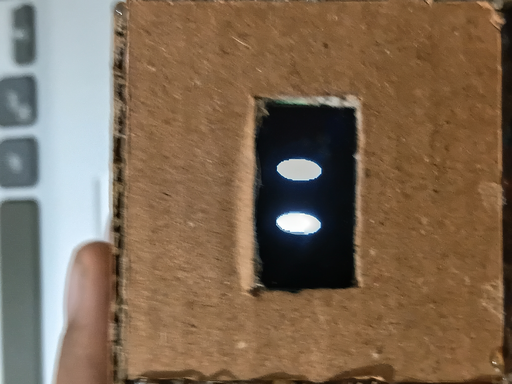
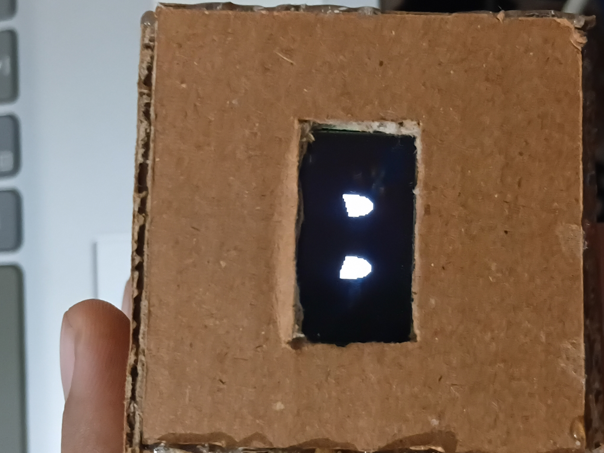
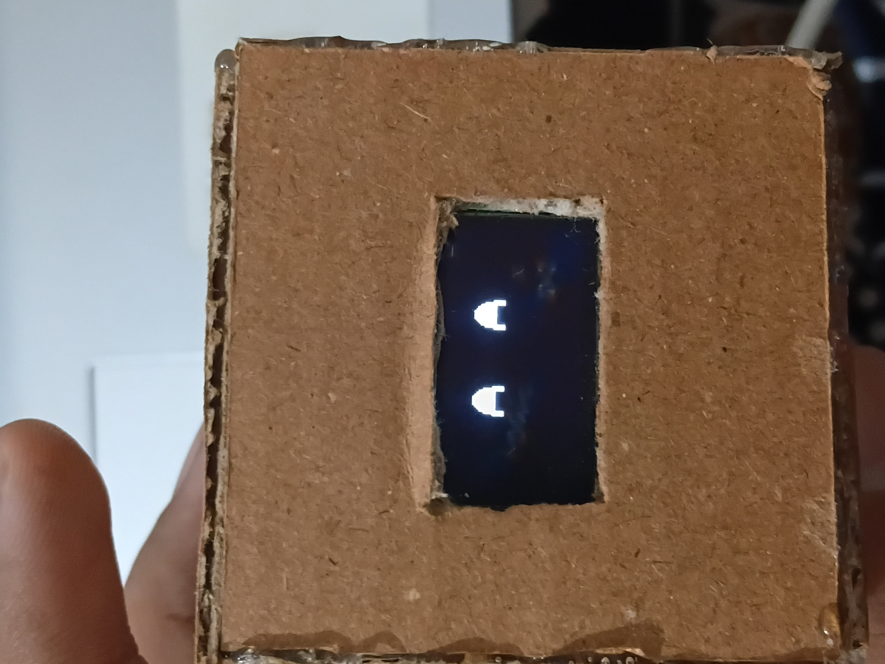

# ESP32-C3 DIY ORTOMI ROBOT PROJECT

A lightweight, browser-based firmware flasher interface for the ESP32-C3 microcontroller utilizing the Web Serial API.  
CREATED A LIGHT WEIGHT DIY VERSION OF ORTOMI GEN 4 ROBOT OLED SSD1306 USED WITH SDA 8 AND SCL 9 ON FOOT.

## Project Overview
This repository contains the source code and files necessary to flash binaries directly to an ESP32-C3 via a modern web browser without needing local installations or command-line tools.

## Files Included
* **`.ino`**: The core Arduino/C++ source code for the microcontroller.
* **Firmware Binaries (`.bin`)**: Compiled binary files ready for deployment.

## How to Use
1. Open the `.ino` file.
2. Select the correct COM port.
3. Upload.
